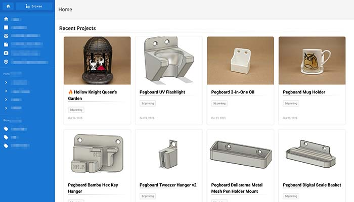

# WikiJS Post Grid

A TypeScript library for displaying WikiJS posts in a responsive grid layout, perfect for landing pages.



## Usage

### Basic Usage

Put the snippet below in the Scripts section of your landing page.

```html
<script src="path/to/wikijs-post-grid.min.js"></script>
<script>
  document.addEventListener('DOMContentLoaded', () => {
    WikiJSPostGrid.showGrid();
  });
</script>
```

And the content of the said page:

```html
<div id="wikijs-post-grid" />
```

### Advanced Usage

```html
<script src="path/to/wikijs-post-grid.min.js"></script>
<script>
  document.addEventListener('DOMContentLoaded', () => {
    WikiJSPostGrid.showGrid({
      maxPosts: 8, // default: 16
      enrichPost: ({ tags }) => {
        // Custom post enrichment - return additional properties
        return {
          isFeatured: tags.includes('featured'),
        };
      },
      filterPost: (post) => {
        // Custom filtering logic - can use enriched properties
        return post.isFeatured;
      },
      sortPost: (a, b) => {
        // Custom sorting logic (default: newest first by time)
        return b.title.localeCompare(a.title); // Sort by title Z-A
      },
      renderOptions: {
        renderDate: (post) => {
          // Custom date formatting
          return new Date(post.createdAt).toLocaleDateString('en-GB');
        },
        renderTitle: (post) => {
          const prefix = post.tags.includes("big project") ? "🔥" : "";
          return `${prefix}${post.title}`
        }
      }
    });
  });
</script>
```

## API

### `showGrid<T>(options?: GridOptions<T>)`

Renders a grid of WikiJS posts in the element with id `wikijs-post-grid`.

#### GridOptions<T>

| Key | Type | Description | Default |
|-----------|------|-------------|---------|
| id | string | ID of the HTML element to render the grid in | `'wikijs-post-grid'` |
| maxPosts | number | Maximum number of posts to display | 16 |
| enrichPost | (post: WikiJsPost) => T | Function to enrich posts with additional properties before rendering | undefined (no enrichment) |
| filterPost | (post: EnrichedPost<T>) => boolean | Function to filter which posts to display | undefined (no filtering) |
| sortPost | (a: EnrichedPost<T>, b: EnrichedPost<T>) => number | Function to sort posts | undefined (no sorting) |
| renderOptions | RenderOptions<T> | Options for customizing how posts are rendered | undefined |
| fetchedPosts | WikiJsPost[] | Pre-fetched posts to avoid redundant GraphQL calls | [] |

#### RenderOptions<T>

| Key | Type | Description | Default |
|-----------|------|-------------|---------|
| renderDate | (post: EnrichedPost<T>) => string | Function to format dates | `post => new Date(post.createdAt).toLocaleDateString()` |
| renderTitle | (post: EnrichedPost<T>) => string | Function to customize the title rendering | `post => post.title` |
| renderTags | (tags: string[]) => string[] | Function to customize tag rendering | `tags => tags` |
